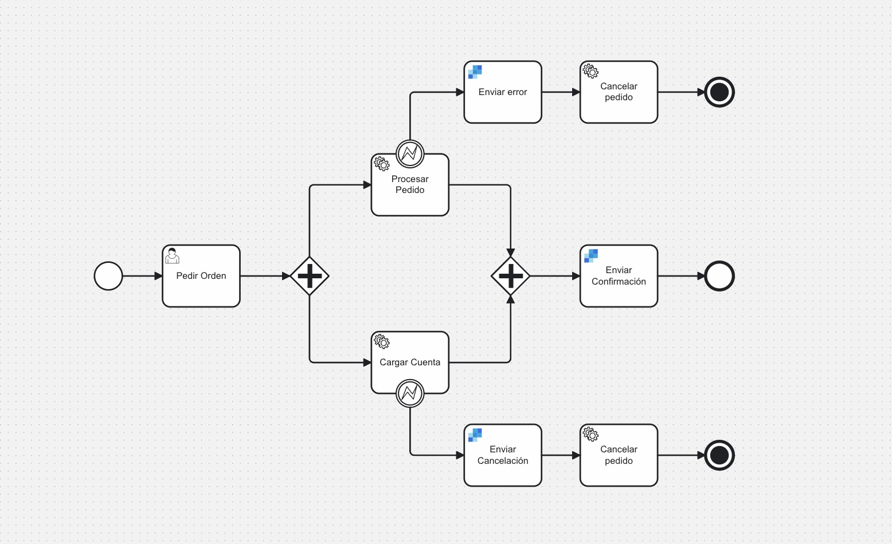

# Ejemplo de Service Tasks y Job Workers en Node.js
Este ejemplo demuestra cómo los microservicios pueden usarse en Camunda 8, utilizando service tasks y job workers.

Este modelo simula el pedido de artículos desde un sitio web, siguiendo hasta la confirmación:

El proceso comienza con un formulario de Camunda, simulando un formulario de pedido, y luego ejecuta dos microservicios en paralelo:
- procesar pedido
- cargar cuenta

Hay un tercer microservicio que cancela el pedido si hay un error en cualquiera de los dos microservicios principales. Se envía un correo electrónico al cliente utilizando el [conector de SendGrid](https://docs.camunda.io/docs/components/connectors/out-of-the-box-connectors/sendgrid/).

Después de que el pedido se procesa y se carga la cuenta, se envía una confirmación a través del [conector de SendGrid](https://docs.camunda.io/docs/components/connectors/out-of-the-box-connectors/sendgrid/) al cliente.

---

## Configuración
### Configuración del SDK de Node.js para Camunda 8
- Instala el SDK de Node.js para Camunda 8 utilizando `npm install @camunda8/sdk`.
- Crea un nuevo clúster de Camunda 8 y [configura las credenciales de conexión del cliente](https://docs.camunda.io/docs/guides/setup-client-connection-credentials/), asegurándote de que el alcance de `Zeebe` esté habilitado. O, accede a tus credenciales de cliente existentes en tu clúster de Camunda 8. Asegúrate de agregar las credenciales a un archivo `.env`.

## Ejecución del Proyecto
Ejecuta el archivo index.js: `node index.js`

Esto iniciará el proceso, que luego puede ser accedido en Operate y Tasklist.